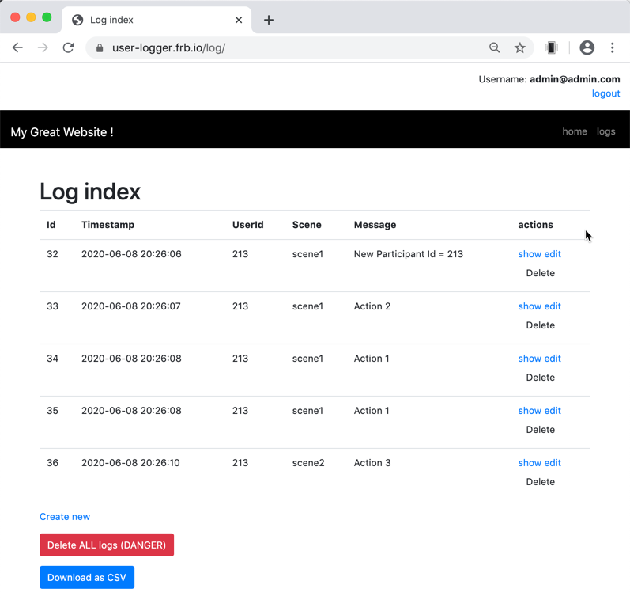

# user-logger-website

This site logs user actions sent via GET
(will change to POST one day...)

version 0.1 created for one of my research students - but might be nice to turn into a longer running project since user logging is pretty useful for usability and ed-software evaluations

